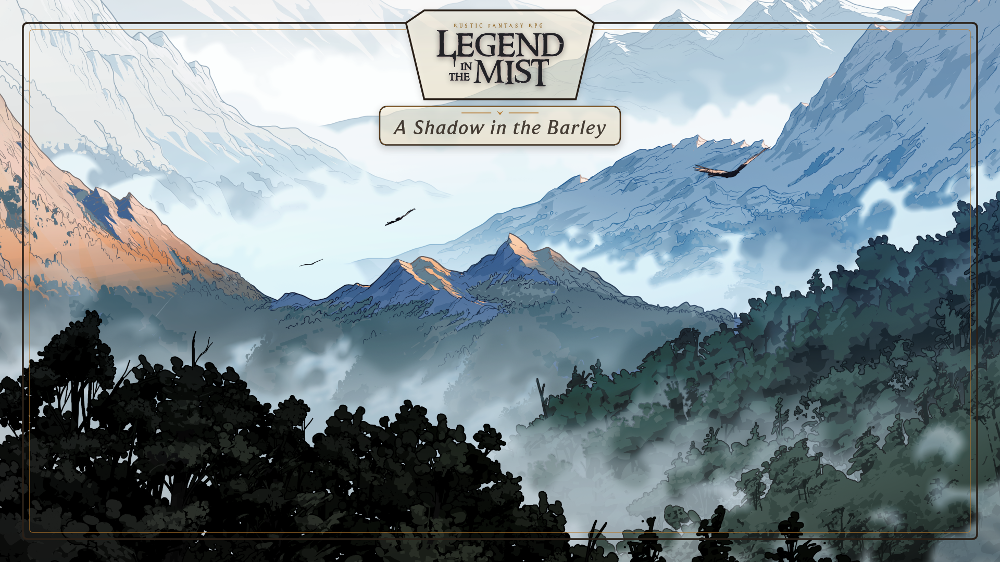

# Legend in the Mist Backdrop Generator

A single-file HTML tool for making title-card backdrops for *Legend in the Mist* games on a virtual tabletop: a vector frame with the official logo built into the top edge, an adjustable plaque for your campaign or one-shot name, and your own background art underneath.



## Use it

Open `litm-campaign-backdrop.html` (or `index.html`, same file) in any browser. No install, no server, nothing to build. It also works as-is on GitHub Pages: everything is embedded in that one file (font, logo, styling, export logic), so there's nothing else to configure once Pages is turned on for this repo.

Type a campaign or one-shot name, drop in your own background image, and adjust the title plaque's size, width, position, font size, and transparency with the sliders. Export a PNG (1080p up to 8K) for your VTT of choice, or grab the SVG if you want a version that stays sharp at any zoom.

## Rebuild from source

`src/` has the Python scripts that generate the page, if you want to tweak the frame geometry or palette instead of editing the generated HTML by hand:

```
python3 src/build_svg.py
python3 src/build_html.py
```

You'll need `fonts/beaufort/medium_italic.woff2` in place first (Beaufort for LOL, from the Legend in the Mist official [press kit](https://sonofoak.com/blogs/story/press-kit-for-legend-in-the-mist).

## License

The code and design here are MIT licensed, see [LICENSE](LICENSE). That covers the build scripts, the generated page, and this README, but not the embedded logo artwork or font (see below).

## Copyright and trademark

Copyright (c) Nebularum. Source and updates: [https://github.com/nebula-rum/litm-campaign-backdrop](https://github.com/nebula-rum/litm-campaign-backdrop)

*Legend in the Mist* is a trademark of Son of Oak Game Studio, and the Beaufort for LOL font belongs to Riot Games. This is an unofficial, fan-made tool, not affiliated with or endorsed by either, and neither the logo artwork nor the font are covered by this repo's MIT license.
